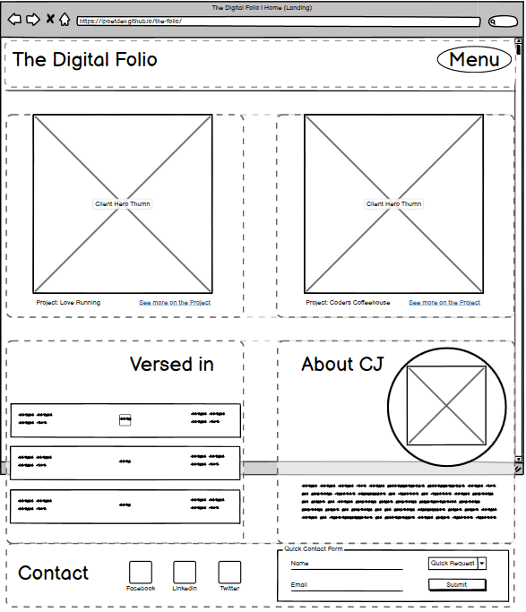
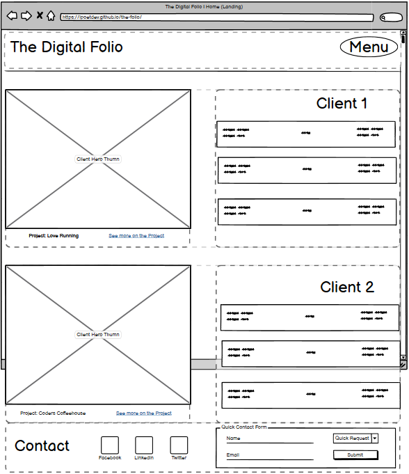
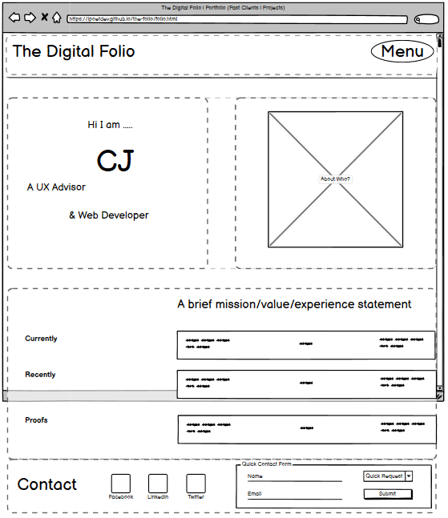

# **The Digital Folio**

<!-- This site is based on a hypothetical proof of concept. With refinement, it could be a production level site, demonstrating technqiue, UX and UI and quality. However not for this version.  -->

The Digital Folio is a portfolio template site that could be used to showcase the work and clients of myself, Charles J Fowler (aka CJ) as a web developer and UX advisor. The site will be focused on promoting the past and current client projects, like Love Runnning and Codes Coffeehouse as examples of potential services rendered. This site showcases the potential for hosting references to other hosted projects and deliverables.

`Screenshot`

> Visit: [The Digital Folio](https://ipoetdev.github.io/the-folio/ "The Digital Folio: https://ipoetdev.github.io/the-folio/ by Charles J Fowler (@ipoetdev)") | [https://ipoetdev.github.io/the-folio/](https://ipoetdev.github.io/the-folio/)

## **Project Goals**

 - Provide a showcase for future projects online for prospective clients to view past work.
 - Provide a high level profile of who I am professionally and personally to prospective clients and/or employers.
 - Provide a contact point for business and contracting enquiries by a contact form.

 ### <ins>Website Owner Goals</ins>

 The site is dual purpose, as a showcase of past initiatives has two key audiences: Potential clients seeking a solition and potential employers seeking an experienced hire.

 - Reach new clients and/or new employers.
 - Establish a web project freelancing footing.
 - Create new employment opportunities.
 - Increase revenue and income.

  ### <ins>User Goals</ins>

  The site should have easy to spot user goals or address user concerns as presented.

As a prospective client:
  - Does the web developer know their clients?
  - Have he produced evidence of past work and demonstrate value?
  - Does he present his clients in a high quality showcase?
  - Can a user find how to contact owner quickly and easily?

As a prospective employer/recuiter:
  - Can a recuiter/decison maker find evidence of past experience?
  - Can a recuiter/decison maker view high level history of current and recent activity?
  - Does user have option to download a resume to take away?
  - Can a user find how to contact owner quickly and easily?

---
---
## **User Experience**


### <ins>Audience(s)</ins>

The website is created with the following in target audience(s) in mind.

- A potential client seeking a website (new or redesign).
- An web agency seeking a contractor for a project.
- A recruiter seeking a hire for a post.
- A decision maker seeking to validate a hire's experience and past work.

### <ins>User requirements or expectations</ins>

- A block level landing page with 4 jump points.
- A website that showcases projects.
  - *[Use Case]* For a gallery view of past & current projects.
    - A collection of past projects and client as a basic gallery.
    - External links to past projects.
    - Brief project synopsis
    - [Enhancement]: List of billable services per project.
    <!-- Note: For purpose of submission: The external websites are not developed, and in lieu, the external links link only to a screenshot of said site as a proxy for a fully developed website. This comment is for assesor review only, visible on GitHub-->
- A simple site map for navigation.
- A responsive layout for most common devices.
- A clear and spacious layout, minimalist in content presentation.
- Clear and unambigious call to actions (one of every page).
  - *[Use Case]* For new business or new leads.
    - A contact card to initiate direct phone call or an email .
    - A quick contact form for online enquiries located in the footer off all pages as a call to actoion.
    - Social Media contact icons.

---
---
## **Design (UXD)**

> Overall: This site is design based less on large image centric graphical designs, but on a bolder but more simpler typo*graphical* design. Hopefull effective use of typesetting gives a brand identity and personalisation to the site. Achiving this is challenging, as this requires a deeper knowledge of fonts, spacing, and design + brand identity impact.

### <ins>Typography</ins>

 - A note: The orginal intention behind this site was to emphasise the graphic nature of fonts and type as a core part of the design metaphor around the foolscape paper size and typesetting.

#### <ins>*Font Families*</ins>

- Therefore the selection of fonts was a time well invested.  The following font categories where used in the design.

   - Title Fonts - Site Logo Texx
   - Header Fonts - Site h2-h3 fonts
   - Navigation Fonts - Large Impactful Navigation Links.
   - Signature/Initals Font - Handwriting stylistic font
   - Text Fonts - Body, Link and h5,h6 fonts.

1. Title/Hero Font: [Lobster Two] (Source: Google, Font Squirel, downloaded) - Title Fonts. Hero fonts are  in the logo as well used  in equivalent areas here a hero graphic is expected by UX principles.
2. Header Font:   (Source: Font Squirrel, downloaded)
3. Navigation Font:  As Per Title Font above.
4. Signature/Initials Font: [Babylonica](https://fonts.google.com/specimen/Babylonica "Designed by Robert Leuschke") (Source: Google Fonts, downloaded) On About Page, used once.
5. Text/Body/Link font: [Kanit](https://fonts.google.com/specimen/Kanit). Sans-serif.
6. Fallback Fonts, primarily as Sans-seif, as so to match primary body font above: As identified by https://www.cssfontstack.com/
    - Trebuchet MS is widely supported:  Win: 99.67% Mac: 97.12%
    - Lucida Grande, Lucida Sans Unicode, Lucida Sans, are common with iOS and MacOS system, with Win: 0% Mac: 100%.
    - "Tahoma" as it like Arial, widely supported with Win: 99.95% Mac: 91.71%
    - Liberation Sans, Liberation Serif are common and widely used with Linux systems.
7. Android is notorious for being tricky, so a wide range of fallback fonts where selected.


#### <ins>*Reasons for Fonts*</ins>

**** was chosen for. This font identifies the site and creates an strong impression on the user, inliue of using a graphic design or image, and keeps aligned with the foolscape paper and typesetting metaphor that gave rise to the concept of the site. This is used in title fonts, hero fonts

**Babylonica** was chosen for as it had *a dry brush style with hand written calligraphic brush characteristics. It's italicized approach is sometimes interrupted by upright or even back-slanted forms giving it an interrupted stress. This stress gives Babylonica that truly hand lettered appeal.* [Google](https://fonts.google.com/specimen/Babylonica/about). This identified a nice way to create an identifible signature out of my initials "C J" standing in for Charles James.

**Kanit** was chosen for its *"notable detail is that the stroke terminals have flat angles, which allows the design to enjoy decreased spacing between letters while preserving readability and legibility at smaller point sizes."* [Google](https://fonts.google.com/specimen/Kanit/about). This idenitified a requirement for clear leigibility of text on mobile devices as well as good zoom/user scaling functionlity. Additional benefits where identified as having a similar ex/x-height of Trebucet MS, the chosen primary fallback font for Windows and Mac operating systems.


 > It is notable that time would be a constraint in choosing, testing and matching a triad of fonts for the project submission, so best efforts were made.

#### <ins>*Type Responsiveness: Fluid, Responsive (@media) or a mixture of both.*</ins>

> Following Design concerns where addressed

- **Should fonts be fluid in responsiveness? Yes.**
  - Such that fonts should scale proportionally and relatively to the screen device size and the average distance between the user's eye and the screen surface/viewport.
  - Solution: Used [Fluid Type Scale Calculator](https://www.fluid-type-scale.com/ " Aleksandr Hovhannisyan (2021-Present), Fluid Type Scale Calculator, version 1.2.1, Last Accessed: 2023-02-13:  https://www.fluid-type-scale.com/") by Aleksandr Hovhannisyan

      ```css
        --font-size-sm: clamp(0.8rem, 0.09vw + 0.78rem, 0.89rem);
        --font-size-base: clamp(1rem, 0.19vw + 0.95rem, 1.19rem);
        --font-size-md: clamp(1.25rem, 0.34vw + 1.16rem, 1.58rem);
        --font-size-lg: clamp(1.56rem, 0.56vw + 1.42rem, 2.11rem);
        --font-size-xl: clamp(1.95rem, 0.88vw + 1.73rem, 2.81rem);
        --font-size-xxl: clamp(2.44rem, 1.34vw + 2.11rem, 3.75rem);
        --font-size-xxxl: clamp(3.05rem, 2vw + 2.55rem, 5rem);
        --font-size-xxxxl: clamp(2.81rem, 1.92vw + 2.08rem, 4.66rem);
        --font-size-xxxxxl: clamp(3.81rem, 4.03vw + 4.45rem, 11.84rem);
      ```
      - Note: I added two more greater sizes and adjusted the preferred and max values for scaling on larger desktop screens and to adjust for these at smaller screen sizes using media queries.
      - URL: https://www.fluid-type-scale.com/

- **Should fluid fonts be used in all cases? No**.
  - While further refinement is needed, a future enhancement, @media queries where used to change the fluid font step to meet the requirements of small screen mobile devices, particularly when in portrait mode and where title/logo space was limited.
#### *<ins>How it Works</ins>*
> Author: Aleksandr Hovhannisyan (2021-Present)

> A modular type scale consists of a baseline font size and proportionally smaller and larger font sizes. Traditionally, design systems used static type scales, where each step has a fixed font size at every viewport width.

> By contrast, in a fluid type scale, each modular step has a minimum, maximum, and variable font size. We can leverage CSS clamp and viewport width (vw) units to generate a set of font size variables that scale linearly between their minimum and maximum sizes, with mathematical precision.

> This is done by solving the equation y = mx + b, which corresponds to the preferred value in a CSS clamp declaration.


### <ins>Iconography</ins>

- Use of FontAwesome *Free* (Version 6, January 2023) icons
- Downloaded icons for social media in the placement of the footer of the page.

#### *<ins>Future Enhancements</ins>*

- Additional use of icons, as future enhancements, would be to give user affordances to:
   - Links i.e. this is a link to an external site, not being a social media one.
   - Navigation button clues to internal navigation panel/internal site links.
   - Download a document on a button hint.
   - Contact details/input references to validation, field names/labels etc
   - Interactive elements not listed above.

### <ins>Color Choices</ins>


### <ins>Accessibility</ins>

> <div style="text-align:right"><b>Interaction | Informatiom Architecture | Structure Plane</b></div>

### *<ins>Information Architecture & Hierarchy</ins>*

 - Sitemap version 1
  > 

  - Sitemap version 2
    > .active


### **<ins>Images</ins>**

#### *<ins>Art Direction</ins>*

> Art Direction is the practice/technique of styleing/sizing images to be repsonsive to the layout / orientation of the viewport, once the image is not 100% of the viewport, i.e. it has whitespace on all axes and does not stretch the full width of the viewport.active

#### *<ins>Client Hero Images (Home Page)</ins>*

> The follow is a example reference for the image layout and scaling across all device screen types. The image is from one client, Love Running, and is only used here as a sample example for image art direction purposes.

*Requirement*
- Have a landing page showcase for one or more clients on the index.html page that is a) fluid to all screen sizes and b) is responsive in aspect ratio to the device orientation and c) changes aspect ratio acordingly to device orientation using Art Direction.

**Mobile: Portrait**


> Image naming was instrumental in the process for alignment with idenitication, sizing and usage.

- Art Direction for this content is for:
  - *Image Aspect Ratio*: 1 / 1
  - *Alignment*: Square, top and center to the client display card/panel with caption directly below it.
  - *Page Layout*: In a 1x Column, Nx Row layout respecting the aspect of the mobile portrait: *height greater than device width*.
  - *Design*: One  1/ 1 square image that is 75% of viewport, croped and focused on the central subject of the image, and keeping some image text in view.
  - *Breakpoints/Devices*:
      - Mobile
        - Standard ( > 360.999px width): Width:
        - Pro (< 361px, > 408.999px): Width:
        - Ultra (< 408, >488.999px): Width:
        - **All (> 548.999px)**:
   - Less than 548 px width Breakpoint is in use for all mobile in this orientation, as it covers all uses cases at a smaller size with fluid images and responsively downloaded images.

**Mobile: Landscape**


- Art Direction for this content is for:
  - *Image Aspect Ratio*: 1 / 1
  - *Alignment*: Square, top and center to the client display card/panel with caption directly below it.
  - *Page Layout*: In a 1x Column, Nx Row layout respecting the aspect of the mobile landscape: *width greater than device height*.
  - *Design*: 1 16x9 image in 1 columns, to 75% of the device viewport, not croped and constrains the full width of the image
  - *Breakpoints/Devices*:
      - Mobile
        - Standard (< 640.999px width): Width: ; (height < 360.999px): Height: ;
        - Pro (> 641px, < 726.999px): Width:
        - Ultra (> 727px, < 834.999px): Width:
        - All (< 834.999px in width, < 500px in height).

**Tablet: Portrait**


- Art Direction for this content is for:
  - *Aspect Ratio*: 1 / 1
  - *Alignment*: Square, top and center to the client display card/panel with caption directly below it.
  - *Breakpoints/Devices*:
      - Tablet
        - Standard (> 360.999px width): Width:
        - Pro (< 361px, > 408.999px): Width:
        - Ultra (< 408, >488.999px): Width:
        - All (> 548.999px).

**Tablet: Landscape**


- Art Direction for this content is for:
  - *Image Aspect Ratio*: 16 / 10
  - *Alignment*: Wide, 16 / 10, top and center to the client display card/panel with caption _____directly below it_____.
  - *Page Layout*: In a 2x Column, 2x Row layout respecting the aspect of the tablet landscape: *width greater than device height*.
  - *Design*: 2 16x9 image in 2 columns, to 45% of the device viewport, not croped and has the full width of the image
  - *Breakpoints/Devices*:
      - Tablet
        - Standard: (width: > 768.999px): Width: ; (height > 548px): Height: 1024;
        - Pro: (width: > 980px, < 1200.999px): Width: 405px
        - All: (width: > 768.px, < 1200.999px ): Width: 405px

#### **Image Compression**

- Used [TinyPNG][#Frameworks Used] to reduce overall image size by selective color compression.
  - > "... uses smart lossy compression techniques to reduce the file size of your WEBP, JPEG and PNG files. By selectively decreasing the number of colors in the image, fewer bytes are required to store the data. The effect is nearly invisible but it makes a very large difference in file size!" [TinyPNG home page](https://tinypng.com/)
- By compressing these images, it is expected to use less bandwidth and load images faster.

### Metaphors

#### *Navigation*

- A full viewport/screen overlay
- Is hidden for minimalist approach.
- Has a large call to action to find the menu
- Acts like a dynamic secondary page.
- Has a footer of its own for secondary content.
- Has A list of links as a menu
- Is called a menu with a large landing area/oval border signalling the affordance that this an action area.
- Some informational artefacts are placed in the footer, like contact details and or any small nugets of text.

1. On desktop this naviation and text logo are fully styled
2. On mobile this navigation and text logo have their styles rediced and simplified due to the smaller screen sizes.

- Bottom Navigation is contains a quick contact form, in lieu of the removed full page contract form.

#### *Site Intents*

- A porfolio website does two things
  - Showcases, in the best possible light, the quality of past efforts a validation and proof of expertise and delievery to clients expectations, i.e. social proof, professional proof
  - Provides a online presence and face to prospective clients who is the name and the person behind the delivery. i.e. identity and relationship opportunities.

#### *Page Intents*

1. Home Page | Landing (index.html)
   - This is the first impression of The Digital Folio.
   - Is a 2 row x 2 colum desktop view graceful degradation grid that slips into a 1 column to 4 row mobile  view.
   - Top row is the client showcase for version 1 of the site. Future enhancements would increase the sophication and interactivity of the showcase for a featured client.
   - Second row is an bredakout of the about section, with clues and brief highlights of the more detailed secondary level 1 page.
      - Left most is are hints to the working Profile with inter page jumps.
      - Right most are a headshot and introduction and a brief bio text.

2. Portfolio Page | Clients (folio.html)

3. About Page | Information (about.html)

## Wireframes

### Wireframes (Desktop)

Revised: Version 2.0 (Designed 13th Feburary). There was no version 1.

#### Home | Landing: index-html



#### Portfolio | Clients: folio.html



#### About | Profile: about.html



---
---

## BUILD

<!-- > N.B: Developer laptop was rebuilt midst project (23-30th January) and reconfigured. So the following applies from the 26th of January. -->

### Environments

<!-- > Did not use Gitpod, too high a friction and high context switching costs. -->

- VSCode Insiders - Local
- LiveServer: http://127.0.0.1

- Github Pages from Github.com

### Browsers

- Google Chrome (Dev) versions 111-112
- Firefox Developer Edition versions 110.0 beta

### Browser Extensions

> <sub>[*] DevTools extenions</sub>

- AxeDevTools, version 4.49.0*
- Responsiveviewer, version 1.0.20

### Languages

-   HTML5
-   CSS3

### IDE

> Extensions: A brief summary of a few key ones.

- HTML Language Server (VSCode)
- CSS Language Server (VSCode)
- HTML Validate (html-validate.vscode-html-validate, 2020-2023), version 7.13.2
- Stylelint (stylelint.vscode-stylelint, 2019-2022), version 1.2.3
- PostCSS Language Support (csstools.postcss), version 1.0.9
- PostCSS Intellisense and Highlighting (vunguyentuan.vscode-postcss), version 2.0.2
- PostCSS Sorting(mrmlnc.vscode-postcss-sorting, 2016-2017 (*Last commit: 5 years ago*)), version 3.0.1.

### Repository

<!-- Packages used for developer quality of life and delivery purposes -->

-   Javascript (Node, pnpm and npmregistry packages)
-   YAML (configuration files for NPM packages)
-   C/make for .gitignore and similar ignore files

#### *NPM Plugins*

<!-- These were used during the build but removed prior to submission -->

- Prettier
- Editorconfig
- HTML-validate
- Stylelint
- Postcss

### Frameworks Used

> Programs, Packages and Libraries used in different workflows, and where code was generated and then adapted for use in the html or the css as a component.

- [Font Squirels Web Font Generator](https://www.fontsquirrel.com/tools/webfont-generator "Font Squirrel: A free font collection for web safe fonts, within in reason, and request to ask for respect to each font's licence"). FAQ: https://www.fontsquirrel.com/faq
    - Use of the Expert Mode to:
      - Generate WOFF/WOFF2 fonts from OTT/TTP formats using Fontsquirrels TrueType Hinting.
      - Fix rendering issues like fixing the GASP Table for better DirectWrite rendering.
      - Adjust and replace missing vertical metrics, spaces, hyphens, as well as match for some fonts (Kanit to Trebuchet, i.e. Font Style Matching for FOUC issues) the x-height by resizing againt Trebucet.
      - Basic Subsetting to redice the size/options/features of the font's files. Custom subsetting is possible.
      - Auto Generation of CSS @font-family code and a custom stylesheet name (not used).
      - Other options was to suffix the font file name with a custon suffix, dquare the em value and no adjust the glyph spacing.
- [Fluid Type Scale Calculator](https://www.fluid-type-scale.com/ " Aleksandr Hovhannisyan (2021-Present), Fluid Type Scale Calculator, version 1.2.1, Last Accessed: 2023-02-13:  https://www.fluid-type-scale.com/") by Aleksandr Hovhannisyan (2021-Present), Fluid Type Scale Calculator, version 1.2.1, Last Accessed: 2023-02-13:  https://www.fluid-type-scale.com/
- [Responsive Viewer](https://github.com/skmail/responsive-viewer "@Skmail, https://github.com/skmail/responsive-viewer")
- [Responsive Image Breakpoings Generator](https://www.responsivebreakpoints.com/ " https://www.responsivebreakpoints.com/") with use of the customisation to:
    - Base 1rem = 16 pixels and no support for older browsers as no fall back CSS included (future enhancement).
    - Select a minimum mobile font size and viewport width for your type scale's baseline step.
    - Select a maximum font size and viewport width for your type scale's baseline step.
    - Select a comma-separated list of names for each step in your type scale.
        - `Small: sm`:
        - `Base: base`:
        - `Medium: md`:
        - `Large: lg`:
        - `Extra Large: xl`:
        - `Extra Extra (..) Large: xxl and xxxl, xxxxl and xxxxl`.
           - `xxxxl` & `xxxxxl` used for signature/identity title text, e.g., initals.
- [TinyPNG](https://tinypng.com/ "https://tinypng.com/: TinyPNG uses smart lossy compression techniques to reduce the file size of your WEBP, JPEG and PNG files")
  - TinyPNG uses smart lossy compression techniques to reduce the file size of your WEBP, JPEG and PNG files.
  - [Use Case] Reduced image size by 73% from mean of 200kb, to mean of 50kb for performance concerns.

#### Readme Tooling

- [Mermaid Live Editor](https://mermaid.live/) for Sitemap and Page hierarchy.

#### Design Workflows

-  (Balsmiq Desktop)[https://balsamiq.com/]

<br>
<br>


---
---
<br>

## CODE

### Features

#### *CSS Layers*

- Use of `@layers` of CSS Cascade & Layering [recommended candidate](https://www.w3.org/TR/css-cascade-5/ "CSS Cascading and Inheritance Level 5") for the following benefits.

    **Benefits**
  - Pseudo-modularisation: Essentially assigning code blocks to certain casade layers due to information architecture and information hierarchy.
  - Loosely coupled, and highly cohessive architecture is a target for many software developers and layers brings this to css implicity.
  - Code level Information architecture: Organising by layers, depending on the strategy choosen to layout the code, allows for demonsatrating code as documentation principle by using named layers and nesting these layers in parent layers, giving the CSS a semantic meaning and ease of maintainbility.
  - IDE Code Folding: A developer quality of life improvement as large sections of code blocks of related content can be hidden from the developer in large code files, such as in the `core.css` file.

  **Constraints**
    - Generates invalid results with W3C Jigsaw, the CSS validator service as it is part of CSS Cascading and Inheritance Level 5. While this was in the CSS 2022 Snapshot, it is not at Working Draft status, though is on track to be ratified.
        - See [Issues](#Issues) for the severity, priority and user impact assessment of this known issue.

#### *CSS Resets*

- Use of external and modern CSS resets is a contentious topic, with some say why give the extra work and others, who like me, what to control as much of the design and not give the UA stylesheet prescendce.
  > *Interesting note: The Browser stylesheet (User Agent), according to Adam Argyle, has, or had, code and code smells from Google Chrome's webkit origins from 30 years ago.*
   - Used Kevin Powells slimed down minimal resets: https://codepen.io/kevinpowell/pen/QWxBgZX, along with [video](https://www.youtube.com/watch?v=2lyDv0wOQuQ "Kevin Powell 30 Nov 2022) Simplest CSS reset to prevent headaches. Last Accessed: 2023 January 11").
   - Applied Elly Loel;s modern css reset, witj her acrediting Josh W Comau, Andy Bell, Adam Argyle for their approaches. [Github Gist]( https://gist.github.com/EllyLoel/4ff8a6472247e6dd2315fd4038926522 "Ely Loel (June 2022) Modern CSS Reset. Last Accessed: 2023 January 11"). Article: https://www.ellyloel.com/projects/modern-css-reset/

#### *Media Queries &amp; Responsiveness*

#### *CSS Container Queries*

- Given a [CUBE-like method](https://cube.fyi/) approach to macro layouts and micro layouts, i.e. component based blocks of content and layout, it was very challenging to have these self contained content panels (aka blocks), be responsive, across all viewport/breakpoint and devices, to:
    - (a) the section panel they were asigned to and respect the intrinici height of the child content and elements as they resized ...
    - (b) to the macro layouts and respond to size of viewport using media queries.
- Negative impacts on layout where lack of intrinsic height awareness of the parent container by the contents of the child container. The intent of the block level approach was to have discrete panels of presentation/content that would be responsive, however, such lack of a size aware container meant content overlfowed into neighbouring content.
- This gave rise to a very poor code smell of overuse of media queries for containment of block components through out the code or alternatively trying to make a page absolutely positon, using magic numbers and calc() to calculate relative positioning of neighbouring elements.

  **Benefits**
    - Gives indepence styling based on size, layout, paint and content style of a block based component, e.g., a panel or a card block, and have control over the layout of the block at different screen sizes.
    - Has good browser support in most modern browsers of Chrome/Edge, Chrome for Android and Safari on Desktop.

  **Constraints**
    - Firefox version 109, released in January 14 2023, does not support `@container`. This is a known issue.
    - As of Feburary 14th, 2023, Firefox Developer Edition, (110) now supports @container and container query units by default. For assessment, please install @latest Firefox Developer edition.
        - Firefox  111 is due for release on March 14th 2023.
    - Fallback solution for those browser who do not support this feature, for backward compatibility:

        ```css
        //For example: Checks if supported in Firefox and fallsback. Only implemented if time permits.

          @supports (@conatiner) or (contain) {
              @media (max-width: 584px) {
                  ...
              }
          }

        ```
 #### *Grids &amp; Flexbox for Layout Patterns*

<br>
<br>


---
---
<br>


## RELIABILITY

### CanIUse.com & Browser Interop (2022)

> About: " *'Can I use' provides up-to-date browser support tables for support of front-end web technologies on desktop and mobile web browsers*". https://caniuse.com/ciu/about

This service was used regularly to check the browser support of selected CSS features that have browser interoperability and parity. Having such does not guarrantee that such css features are in the current Working Draft Specifications for each CSS Component, thus by extension, would not be detected by the CSS Jigsaw validator.

- CSS Snapshot 2022 is the [latest stable CSS overview of CSS for 2022](https://www.w3.org/TR/CSS).

- Candidate Recommendations not yet part of Working Drafts and are still not validated by [W3C CSS Jigsaw](https://jigsaw.w3.org/css-validator/), inclusive of a feature I used:
   - CSS Layers/CSS Layering, as part of [CSS Cascading and Inheritance Level 5, Section 6.4 (13 January 2022)](https://www.w3.org/TR/css-cascade-5/#layering)

### Targeted Browsers

For the submission: Chrome was the defeacto browser. However this was jointly used side by side with Firefox Dev 110 as it had better grid and flexbox developer tools and easier to inspect.

Source: [Can I Use's Compare Browsers](https://caniuse.com/?compare=chrome+104&compareCats=all) and [Browser Usage Tables](https://caniuse.com/usage-table)

Use an N for Current Version and formula of N-4 for Full Browsers and N-5 for Dev Versions for the browsers, the follow browsers were targeted.

- Chrome 110.405 and N-4 versions.
- Firefox 119.382 and N-4 versions
- Safari 16.3: 375 and N-4 versions (16.3 -> 16.0).

#### ***Future Testing***

Future testing for better desktop cross browsing support would be focusing on

- Edge 109 and N-4: (109 - 106).
- Opera 94 and N-4: (94 - 91).

- Additionally, development and testing would also include the Chromium open source version as a testing platform.
- Employing a cross browser testing platform like BrowserStack is an option for automation and scalling across multiple browser types. This is beyond scope here, and is a future enhancement to the build, test and deploy process..

**Mobile Browsers**

- Chrome for Android: 109. Though it is assumed that Chrome for Android has feature partity with Chrome for desktop where reasonable assumed.
- Firefox for Android: 109.
- Safari for iOS 16.3 and N-4: (16.3-16.0). Is feature/version partity.
- Samsung Internet

> IE is exluded as it was sunsetted by Microsoft in June 2022 for Windows, and is no longer supported, and is to be removed from Windows 10 this month. However this exluded many of potential business users (who are my target audience who by enterprise policy, maybe still using IE 11 - 9, in edge use cases on long term support agreements).

---
## Testing & Verification

### Verification

> Verifies responsiveness in all common devices.

---
### Validation

#### *HTML*

#### *CSS*

Use of [W3C Validation Service, CSS Jigsaw](https://jigsaw.w3.org/css-validator/)

- CSS @layer is not in the current working draft specification, as of Feburay 17th 2023, though is supported by all modern browsers as per Interop 2022.

    As such causes CSS Jigsaw to invalidate this syntax. See [Issues > Unresolved below](#Issues)

#### Lighthouse

**Home**

**Folio**

**About**

---
### Issues

#### ***Bugs***

- Did not record and track issues, and fixes, throughout the lifecycle of the project. Just had an issue and then fixed them. The bugs/issues at submission are recorded.

#### ***Unresolved***

The following Bugs were know at time of submission:

- Unable to complete first version of the information architecture of 5 pages. Refactored design into 3 pages and attempts to reuse code from prior efforts at time of submission. *[Design | UX Process]*
    - `Severity: Major` **|** `Priority: High` **|** `User Impact: Unknown/TBC`
- `@layer` (CSS) caused invalidation errors in CSS Jigsaw due to CSS Layers not being a full working draft spec; though it is widely supported on all modern browsers from March - June 2022 as part of the CSS Interop efforts. This code is a developer feature and is not a visual interface bug and thus is invisible to the user. *[Build | CSS Syntax]*
    - `Severity: Minor` **|** `Priority: Low` **|** `User Impact: Neglible`

<br>
<br>


---
---
<br>

# DEPLOY

## Features

### Logo & Navigation Bar:

- Large typographical logo, reliting on the styling of the logo's font for its minimal but essential graphical qualities.
- Consistency in useing font for Menu button/toggle as a call to action to user to click on the menu.
- Broad Navigation bar that is responsive across all devices.

### Navigation Panel

- Use of a full screen navigation panel, acting like a magic page of content and large, accessible text (selected typography is part of site identity) for all users.
- Use of space to give roomy, if basic/minimalism, look and feel. Consistency of space is a feature and a challenge across all devices.
- Ensuring consistent bradning by Logo and Menu in Navigation Panel as well as on each page.
- Remove and scale certain style elements on mobile views that are present on desktop views (borders, lines and scaling down of font sizes for certain smaller screen widths).
- Addition of a navigation footer, idenitical to page footer, for consistency and for minor twisting of convention.

### Grid-like Layouts for Content

- Use of grid like layouts for complex, side by side card components to be arranged across the page in various grid patterns and with spacing/gaps in between.
- Challenge was to get these macro layouts and their respective card components (micro/mid components) to be responsive across selected screen sizes and orrientations (portrait and landscape).
- Top row of grid to showcase current/previous projects.
### Hero Client Showcase Images

- Display two large hero images of previous projects on top row of home page grid layout.
- Have a project label and a internal jump link to folio.html

### Display About Details

- Have a hero/headshot image with a strong color border frame on right most bottom panel of page with some light marketing bio copy text describing the owner.

### Display Versed Details

- Have a light details hints and clues to what the site owner in currently learning, recently awarded and have proof off having skills in tools or services to be available.

### Larger Footer with Contact Quik Form

- A large bold footer of constrasting | complementary | consistent color to page.
- Uses same, if smaller, title/logo or heading fonts for key features like links or just identity.
- Has a small form, of 3 fields for a quick message as a call to action where user inputs a name, an email and chooses a topic to contact the site owner about.
- Send to an email address (nominally info@folio.digital, but for submission, authors current email address.) when user clicks send.

### Resume Download Button

-
### Future Enhancements

#### Defintion of Done Requirements to be Delivered

- Required input indicators
-

#### ***[Context]* Home Page**

- Combine the two project hero cards (top row) into an all-in-one carousel.
- Create a modal dialog for a quick contact form as a on page CTA instead of asking user to fill out a larger form.

#### ***[Context]* About | Info**

- Redesign using @container queries and try flex box for macro page layouts.
    > Issue: Refactored page too many times, and regressed technique and design, that ended using absolute positioning regessivel for all macro layouts. Pixel perfect design is flawed but roughly responsive.
- Create a 2-3 step/page (A see more) inner page user flow to dive into the work experience,

#### ***[Context]* Folio**

- With only two projects showcases, this is a very simple gallery. As projects grow, and more content is possible, the  a redesign for page would be preferable, giving each project its own showcase item page from a gallery view page.
- Repeat the carousel as a hero banner on top of Folio with a internal jump link to each client page.

#### [New]

- Add list/hint services available component with pricing per client page.

#### All Pages

- Improve accessibility with ARIA/WAI CAG tags and test against other forms of disability and impairment and interactive modes Further research and development.
- Implement Dark and Light modes with an toggle
- Add an accessibility navigation control to allow users to control the following preferences
    - Reduce Motion
    - Color Contrast (additional color schemes)
- Start cross-browser testing for N-4 browsers across desktop and mobile
- Start backward compatibility by using pollyfills and -moz- and -webkit- and -o- variants of css properties.
- Support retina screens and DPI for media queries and responsive images/media.
- Improve support for media queries for mobile landscape orrientation.
- Add back in the Contact form page and align functionality withe the quick form.
- Refresh and design the look and feel.

---

## Deployment

- Github & GitHub User Account.
- VSCode with Gitlens.
- Github Pages with a domain of Github.io.

### Repository Service

- Github.com is the remote code repository service being used.
- User account and profile is
  > - `@iPoetDev`
- The repository name is
  > - `the-folio`
- The repository domain uri is
  > - `https://github.com/iPoetDev/the-folio`

### Local Git Service / IDE

- VSCode configured witth Github account for Local development environment.
- VSCode extention: Gitlens installed and enabled for local developmemt and deployment.
- Utilisied a Changelog format to document the changes, a la, [Keep a Changelog](http://keepachangelog.com/).
  - Intent here was to catelog in longer more human readable format a more contextual change history. Greater than the 50 chars of a commit 1st line.
  - Additionally, utilsied gthe changelog as a summation effort to shorted and be precisie on the commit description.
- Most adhered to [Semantic Versioning](http://semver.org/) approach.
  - Minor adjustment was to put a double digit index for each separate commit if several occured on one day.

### Deployment Environment

- Github Pages via the inbuilt Github Actions workflows of:
  1. Deploy a static web page off every commit.
  2. Once the commit is built, then deploy the new website and pushes to hosted domain URI.
- Github.io is the hosted domain URI and service.
- The final URI is
  > `https://github.com/iPoetDev/the-folio`

---

## LAUNCH

### Live Site

In deploying to Github;s website hosting service, GitHub pages, the website was created. The steps to deploy are as follows:
- Login to Github and search for the Github repository 'the-folio' by `@iPoetDev`
- Click on the `Settings` cog ico at the top of the repository.
- Click on `Pages` on the left hand side navigation menu.
- Select `Deploy` from a branch' under `Source` if this is not already selected.
- Under the `Branch` drop down menus, select 'main' and 'root'
- Click `Save`
- Once the page refreshes, the live link should appear underneath the 'Github Pages' title.

The latest version, and prior versions, of the site can be found under the `Actions` tab and in the latest version of the workflow `pages build and deployment` as well as above.

Live link is: [https://ipoetdev.github.io/the-folio/](https://ipoetdev.github.io/the-folio/)

<!-- ### Forking this repository -->

### Cloning this repository

This repository is not for cloning. Upon request, it will be made private for future reference.
<br>
<br>


---
---
<br>

## Assesment

### Credits

#### Frameworks/Tooling

-   ResponsiveViewer.org (Oct 2022) "About Responsive Viewer - Chrome Extension". Last Accessed: 2023-02-16 from https://github.com/skmail/responsive-viewer
-   Deque (2023), "axeDevTools". https://www.deque.com/axe/devtools/
-   Cloudinary (2023) "Responsive Images in HTML: A Practical Guide", Last Accessed: 2023-02-13. https://cloudinary.com/guides/responsive-images/responsive-images-in-html-a-practical-guide from https://github.com/cloudinary/responsive_breakpoints_generator.
-   Aleksandr Hovhannisyan (2021-Present), "Fluid Type Scale Calculator: version 1.2.1", Last Accessed: 2023-02-13:  https://www.fluid-type-scale.com/

##### *IDE Extensions*

> *A selection of key extensions that touched the code.*

-  HTML-validate.org, "HTML-validate, Offline HTML5 validator". https://marketplace.visualstudio.com/items?itemName=html-validate.vscode-html-validate from https://gitlab.com/html-validate/vscode-html-validate
-   Stylelint.io "Stylelint". from https://github.com/stylelint/stylelint
- Vu Nguyen,"PostCSS Intellisense and Highlighting" https://marketplace.visualstudio.com/items?itemName=vunguyentuan.vscode-postcss from https://github.com/vunguyentuan/vscode-postcss
- mrmlnc, "PostCSS Sorting".  https://marketplace.visualstudio.com/items?itemName=mrmlnc.vscode-postcss-sorting from https://github.com/mrmlnc/vscode-postcss-sorting

#### Design

- MDN, Mozilla.org (1998-2023) "MDN Web Docs". Last Access: 2023-02-17. https://developer.mozilla.org/en-US/

##### Fonts

> Downloaded fonts locally and hosted those that where needed.

- [Babylonica](https://fonts.google.com/specimen/Babylonica "Designed by Robert Leuschke"), designed by [Robert Leuschke](https://fonts.google.com/?query=Robert%20Leuschke)
- [Kanit](https://fonts.google.com/specimen/Kanit "Designed by Cadson Demak"), designed by [Cadson Demak](https://fonts.google.com/?query=Cadson%20Demak)

**Font Services**
- Google Fonts (2000-2023). Downloaded thes only.
- [FontSquirel (2023)](https://www.fontsquirrel.com/ "Font Squirrel: Free Fonts: https://www.fontsquirrel.com/faq"). [Read FAQ](https://www.fontsquirrel.com/faq)
- [Font Style Matcher](https://meowni.ca/font-style-matcher/index.html) for webfonts and flash of unstyled text (or FOUC) concerns.

#### Color

-
- Contrast Grid (2017-2021). "Contrast Grid, version 1.1.0". Last Accessed: 2023-02-16.https://contrast-grid.eightshapes.com/?version=1.1.0, from https://github.com/EightShapes/contrast-grid.

#### Art Direction  & Images

- Cloudinary, as above, for Responsive Images Breakpoint Generator.


#### Content

- All content copy is self created and authored.

#### Media

- Charles J Fowler, (2015) "Looking Forward". Private use.
- Jan Andraschko, (2018) "About Who?". Private use.
- @Ajgreaves & Code Institute (2020-2023). "Love Running". Last Accessed: 2023-02-10. https://ajgreaves.github.io/love-running/. Media used: Screenshots of website and content references, URIs.
- Code Institute (2020-2023). "Coders Coffeehouse - "

## Acknowledgements

### Code Repository

-  Elly Loel "A modern css reset" Last Accessed: 2023-01-11. Last Updated: 2023-02-11. https://gist.github.com/EllyLoel/4ff8a6472247e6dd2315fd4038926522 ✮✮✮


<!-- ### Tutorials -->

### Guides

-  Miriam Suzanne, CSS-Tricks.com (2020, Oct) "A Complete Guide to CSS Media Queries". Last Updated: 2022-10-19. https://css-tricks.com/a-complete-guide-to-css-media-queries/
-  Andres Galante, CSS-Tricks.com (2020, Oct) "A Complete Guide to CSS Media Queries". Last Updated: 2022-10-19. https://css-tricks.com/a-complete-guide-to-css-media-queries/
-  Chris Coyier, CSS-Tricks.com (2020, May) "A Guide to the Responsive Images Syntax in HTML" Last Updated: 2022-08-25. https://css-tricks.com/a-guide-to-the-responsive-images-syntax-in-html/
-  Chris House, CSS-Tricks.com (2021, May) "A complete guide to CSS Grid". Last Updated: 2023-02-09. https://css-tricks.com/snippets/css/complete-guide-grid/#aa-grid-properties
-  Chris Coyier, CSS-Tricks.com (2013, Apr) "A complete guide to Flexbox". Last Updated: 2022-12-09. https://css-tricks.com/snippets/css/a-guide-to-flexbox/
-  Chris Coyier, CSS-Tricks.com (2020, Feb) "A Complete Guide to Links and Buttons". Last Updated: 2022-02-22. https://css-tricks.com/a-complete-guide-to-links-and-buttons/. Download button on About.html

### Video

- Kevin Powell: "Simplest CSS reset to prevent headaches" Last Accessed: 2023-01-11:https://www.youtube.com/watch?v=2lyDv0wOQuQ,
- Una Kravets: Video Playlist "Designing in the Browser". https://www.youtube.com/playlist?list=PLNYkxOF6rcIDI0QtJvW6vKonTxn6azCsD.
- Rachel Andrews: Video: "How to understand CSS". https://youtu.be/9uARaWJ9mXI. The `display: flow-root` property.
